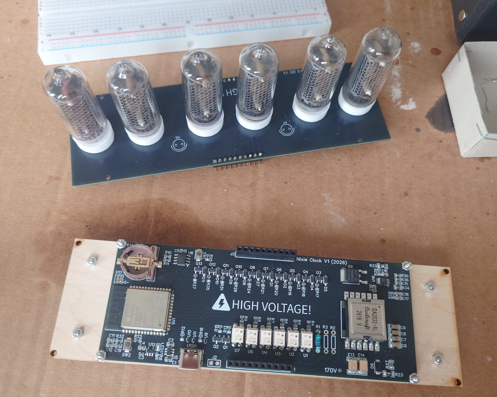
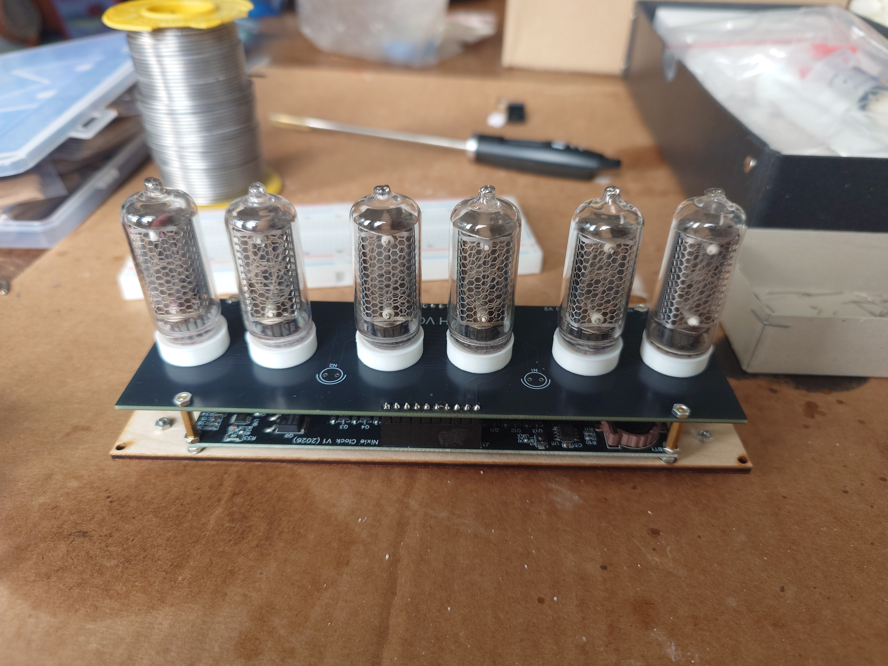
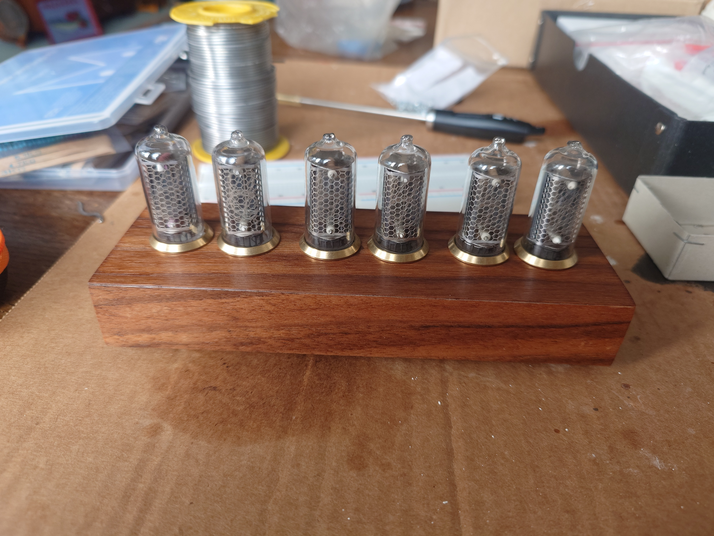
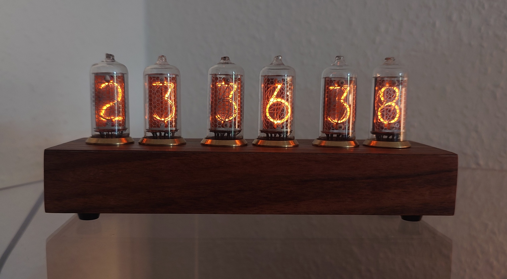
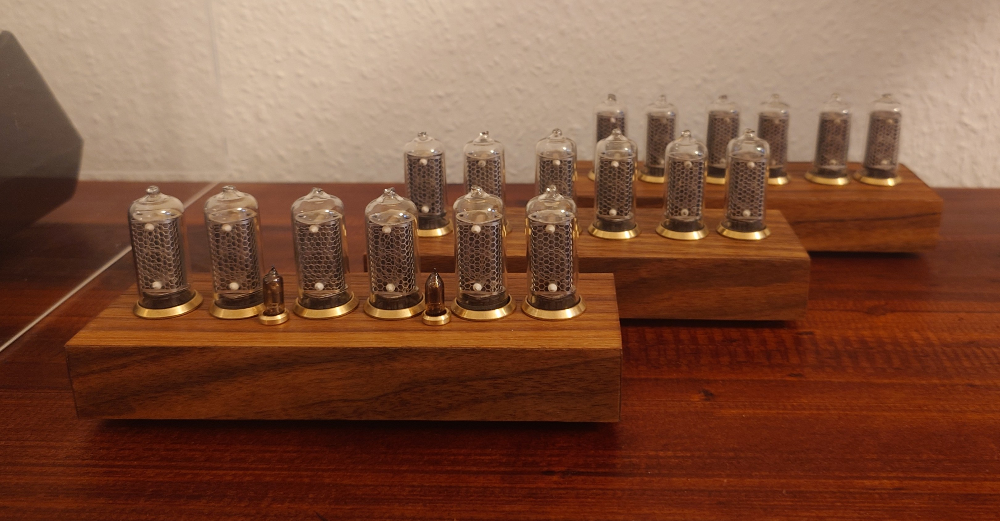
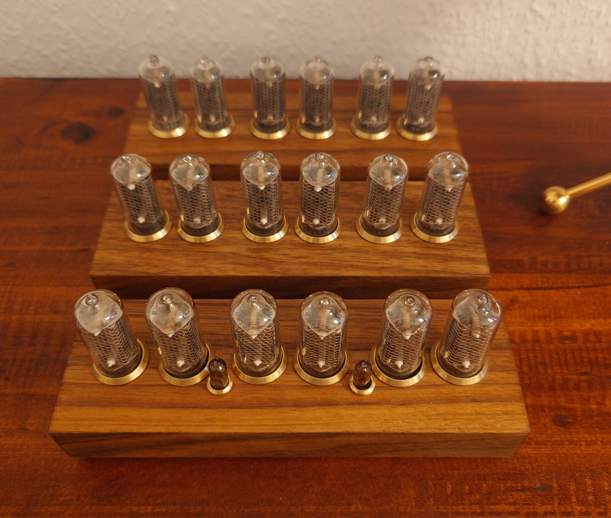

# Nixie Clock

This repository contains the project files for my DIY Nixie clock. It was designed to support virtually any model of Nixie tube, and consists of a tube-agnostic main PCB that interfaces with a secondary interchangeable PCB designed specifically for a particular model of Nixie tube.

## Structure

- [/dashboard](/dashboard/): Source code of the web interface through which the clock can be configured by the user

- [/flashing-tool](/flashing-tool/): Source code of a web tool which allows the user to easily update their clock to the latest firmware release. Based on the [esptool-js](https://github.com/espressif/esptool-js) library by Espressif.

- [/misc](/misc/): Various miscellaneous files related to this project. Includes 3D models for solder guides and tube spacers.

- [/production](/production/): Production files for the clock. Includes Gerber and BOM files for the PCBs as well as instructions for a laser-cut case *(coming soon)*.

- [/schematics](/schematics/): Schematics of the clock *(coming soon)*.

- [/software](/software/): Source code of the clock's core software.

## Pictures

These are pictures of some clocks I built using Soviet IN-8-2 tubes.

<table>
    <tr>
        <td></td>
        <td></td>
        <td></td>
    </tr>
    <tr>
        <td></td>
        <td></td>
        <td></td>
    </tr>
</table>